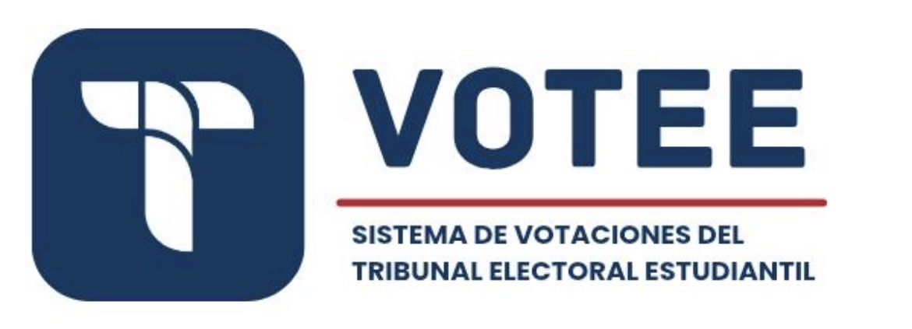

# José Fabián Zumbado

CS @ <a href="https://www.tec.ac.cr/">TEC</a> — I build things somewhere between backend, data, cloud and AI.

Lately: distributed-ish systems, observability, MLOps, and figuring out how much infrastructure a project actually needs.

 

## 🚀 Selected work

<table>
<tr>
<td width="50%" valign="top" align="center">
  
    
  <strong>TEE Voting System</strong>
    
  Institutional voting platform for TEC. I led the project and worked across identity, eligibility, anonymous ballots, custody-gated scrutiny, audit trails, observability, and the full CI/security pipeline.
    
  
  
  
  
  
    
  
  
</td>

<td width="50%" valign="top" align="center">
  
    
  <strong>ExoMamba</strong>
    
  Research project using selective state-space models to classify exoplanet signals in full 18,000-cadence TESS light curves. Includes reproducible baselines, statistical tests, ablations, and a five-seed ensemble.
    
  
  
  
  
    
  
</td>
</tr>

<tr>
<td width="50%" valign="top" align="center">
  
    
  <strong>UFC Picks</strong>
    
  Fight-night prediction platform with automated ESPN ingestion, section-aware pick locking, scoring, stats, and leaderboards. The scraper keeps cards, results, timings, and media in sync.
    
  
  
  
  
  
    
  
    
  
  
  
</td>

<td width="50%" valign="top" align="center">
  
    
  <strong>Album Bot</strong>
    
  Telegram platform for tracking the 2026 World Cup sticker album: collection progress, missing and duplicate stickers, shared albums, friends, and coordinated trades.
    
  
  
  
  
    
  
  
</td>
</tr>
</table>

## 🧩 More things I've built

- **[bilo](https://github.com/JoseZum/bilo-backend)** — a modular backend prototype for the rental journey: discovery, matches, leases, payments, disputes, and trust.
- **[Restaurant Data Platform](https://github.com/JoseZum/restaurantes-olap)** — Spark + Airflow ETL, a Hive/Parquet warehouse, Superset dashboards, and graph-based delivery routing with Neo4j.
- **[Pokédex](https://github.com/JoseZum/pokedex)** — a small FastAPI adapter and React client with normalized DTOs, caching, and clean failure handling.
- **[Bank Insight Engine](https://github.com/JoseZum/bank-insight-engine)** — campaign analytics and financial product recommendations built around an ETL workflow.

## ⚙️ The stuff I actually use

**Languages**

**Building**

**Data & infra**

 

thanks for scrolling this far 🖖

